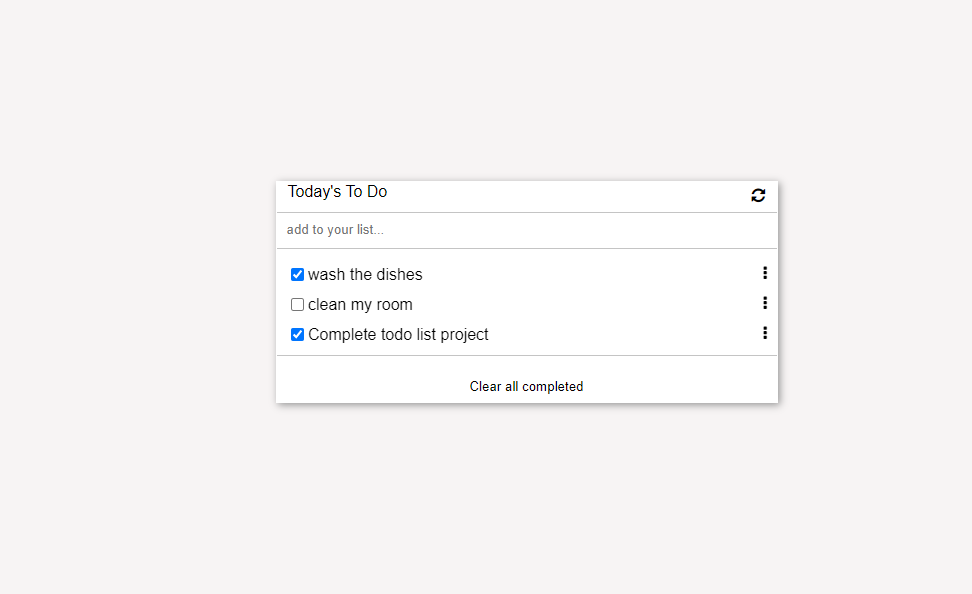

# todo_list


## Built With 

- HTML/CSS
- JavaScript
- Node.JS

=======

## Live

[here](https://m05e5.github.io/todo_list/)

## Getting Started

you can clone the repository by using the command below and run the "npm install" command to install the necessary tools

[`git clone https://github.com/m05e5/todo_list`](https://github.com/m05e5/todo_list)
## Learning objectives

- Use webpack to bundle JavaScript.
- Learn how to use proper ES6 syntax.
- Use ES6 modules to write modular JavaScript.

=======

### Setup

```cmd
git clone https://github.com/eroiyo/To-do-list
cd ./To-do-list
npm install
npm run build
npm start
```

If you are non a technical person you can download the zip file.

- To do that you have to go to the green button that says 'Code' and then press on it.
- Choose the option 'Download Zip' and wait until it download.
- Then you need to decompress it.
- You will need to have Zip compress file software installed in your computer. If you don't have it you can download it from here
  [`https://www.7-zip.org/download.html`](https://www.7-zip.org/download.html)
- Do double click on the Capstone-1.zip and choose a folder where to place all teh decompressed files.
- Once you are done decompressing, you can open the created folder.
- In it you can double click on the index.html file and choose a browser to open it (For example google Chrome Browser).
- Now you should be able to see the project.
- Remember to use the mouse to navigate through the website. Also you can use the keys 'arrow up' and 'arrow down' of your keyboard
  to scroll up and down.

=======

## Author

👤 **Caleb Moses**

- GitHub: [@caleb](https://github.com/m05e5)
- LinkedIn: [Caleb Moses](https://www.linkedin.com/in/caleb-moses-0a1b531b9/)

=======

## 🤝 Contributing

Contributions, issues, and feature requests are welcome!

Feel free to check the [issues page](https://github.com/m05e5/todo_list/issues/4).

=======

## Acknowledgments

- Microverse for giving me this chance
- The amazing code reviewers for making me improve every day :thumbsup:

## Show your support

Give a ⭐️ if you like this project!
